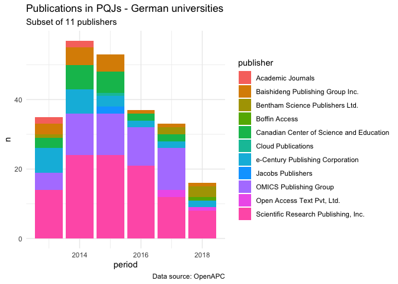
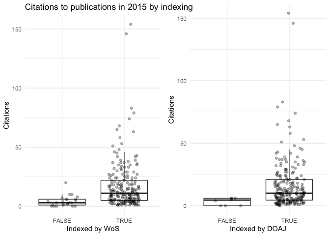

# OA publishing at UGOE
In this report we explore aspects of Open Access (OA) publishing behaviour at the University of Göttingen (UGOE), including the University Medical Center (UMG). Our observations are based on publicly available datasets, in particular we combined data from:

* OpenAPC data, https://github.com/OpenAPC/openapc-de (download date as of processing of 25 May, 2020)
* Journal lists provided by Directory of Open Access Journals (DOAJ), https://doaj.org/csv (as of 21 March 2020)
* Journal list by Scimago (based on Scopus/Elsevier journal lists) (as of 19 March 2020) https://www.scimagojr.com/journalrank.php?openaccess=true&out=xls
* Journal list by Web of Science (WoS), https://mjl.clarivate.com/home (as of 21 March 2020)
* Crossref data, API accessed via R Crossref package (as of 19 May 2020)
* Altmetrics data, API accessed via R Altmetrics package (as of 19 May 2020)

## Spendings on OA publication costs (2012-2019) 

Our analysis is based on the OpenAPC dataset which brings together information about article publications costs (APCs) for 106911 publications from 263 institutions (for the period from 2005 to 2020). These journal articles were published in 7153 journals of which 788 were neither indexed by Web of Science, Scimago/Scirus nor the Directory of Open Access journals (DOAJ). 

In the following, we focus on the subset for the University of Göttingen (UGOE) including the University Medical Center (UMG).  
\newline

<!--html_preserve-->

<!--/html_preserve-->
Overall UGOE spend 2.4905346\times 10^{6} Euro on 1673 publications, published in 432 journals during the period 2012 to 2019.  

The following figure shows the spendings on APCs via UGOE's publication fund over time, from its inception in 2012 to 2019. 

<!-- -->

The following tables and figures show the development of the average costs over time. The increase per year varies substantially, with stronger increases from 2012 to 2016, until an average APC of about 1,600 Euros per article was reached (based on median). 

 
<!--html_preserve-->

<!--/html_preserve--><!-- --><!--html_preserve-->

<!--/html_preserve-->

The four most popular publishers in terms of publications (Springer Nature, PLOS, Frontiers Media SA, Springer Science + Business Media) published 1030 articles (61.56%) which corresponds to a share of 66.55% of the spendings on APCs. 

## Identifying potentially questionable journals and publishers
In the following exploration we consider a subset of publishers/journals which may be classified as questionable (in the following referred to as PQJs):

* Academic Journals: massive list of journals with very small number of papers, questionable author affiliation information (e.g. "Department of Fiction, Antioch University" does not seem to exist, https://doi.org/10.5897/IJEL2015.0889), unlikely paper processing dates (e.g. Received: 12 December 2015; Accepted: 14 June 2019; Published: 30 June 2019)
* Scientific Research Publishing, Inc. - questionable impact metrics
* Impact Journals, LLC - was listed as predatory, however, currently indexed by WoS
* Open Access Text Pvt, Ltd. - unclear
* Canadian Center of Science and Education - questionable impact metrics
* Baishideng Publishing Group Inc. - unclear
* e-Century Publishing Corporation - unclear
* Bentham Science Publishers Ltd. - unclear, was listed as predatory, e.g. for spamming, see also https://rationalwiki.org/wiki/Bentham_Science_Publishers 
* Cloud Publications - many nearly empty journals, overstating/misleading benefits of OA for authors (e.g. "maximize the citation", "fast publishing", cf. http://www.cloud-journals.com/cloudjournals-open-access-policy.html)
* Jacobs Publishers - nearly empty journals 
* European Centre for Research, Training and Development, United Kingdom - claims to be indexed by DOAJ, many nearly empty journals
* Boffin Access - unclear

Overall, of the 432 journals that were used by UGOE authors in the context of the publication fund 45 journals were neither indexed by WoS, Scopus or DOAJ. 

The following tables and plots summarise information on publications in the  potentially questionable journals as described above for UGOE, universities based in Germany, and all institutions which contributed to the OpenAPC dataset. It must be noted that for many institutions the data for 2019 is not yet available. In 2019 no co-funding was granted by the University of Göttingen's publication fund for any publications in the journals of the eleven considered potentially questionable publishers.  

<!--html_preserve-->

<!--/html_preserve--><!-- --><!--html_preserve-->

<!--/html_preserve--><!-- --><!-- -->

## Journals used by UGOE authors, not indexed by WoS/Scopus/DOAJ

<!--html_preserve-->

<!--/html_preserve-->
Overall, 56 journal articles have been published in 45 journals which were neither indexed by WoS, Scopus nor DOAJ. 

## OpenAPC spendings on papers in journals which are neither indexed by WoS, Scopus or DOAJ - Germany only
<!--html_preserve-->

<!--/html_preserve-->

From the table above we consider the following journals as uncritical:

* journals published by Elsevier, Springer Nature, SAGE, Hindawi, Informa (and others, tbc) 
* Copernicus Discussion papers 
* Akademiai Kiado Zrt., European Journal of Microbiology and Immunology - part of Wolters Kluwer, founded in 1828 by the Hungarian Academy of Sciences (HAS)

Some journals may need further investigation, e.g.:

* American Research Institute for Policy Development, INTERNATIONAL JOURNAL OF GENDER & WOMEN'S STUDIES - unclear, not a research institute, publishing seems to be the main activity 
* Austin Publishing Group, Austin Journal of Clinical Neurology - unclear
* Elmer Press, Inc., Journal of Medical Cases
* International Cardiovascular Forum Journal, JCSM Clinical Reports
* ISPUB, The Internet Journal of Pain, Symptom Control and Palliative Care
* Research Institute for Progression of Knowledge, International journal of education and social science - misleading information on indexing 

## Measuring impact and attention

### Citation counts
Citation counts are based on Crossref citation data, i.e. only available for publications with a DOI (1665 out of 1673 papers). The figures below show the distribution of citations to papers published in 2015, comparing those which are indexed by WoS resp. DOAJ or not. 

<!-- -->

  

  

<!-- -->

### Alternative metrics
Altmetrics collects information about social media mentions for publications with a DOI, e.g. citations/mentions on Twitter, citations by Wikipedia, etc. 

<!-- -->

### 

<!-- --><!--html_preserve-->

<!--/html_preserve-->

For the figure above it must be taken into account that mentions on Twitter could only be found for 1189 out of 1673 publications. One highly cited paper was not taken into account for the regression based on citations vs. Twitter mentions (published in 2014, 312 citations according to Crossref).

The table shows publications which have been tweeted at least 50 times (original tweets and re-tweets).
